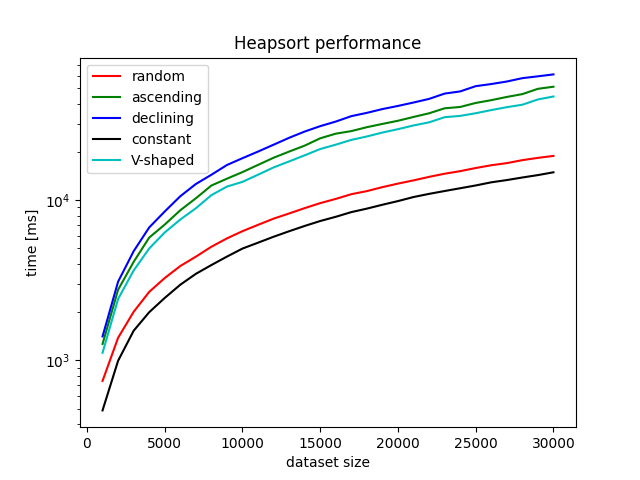
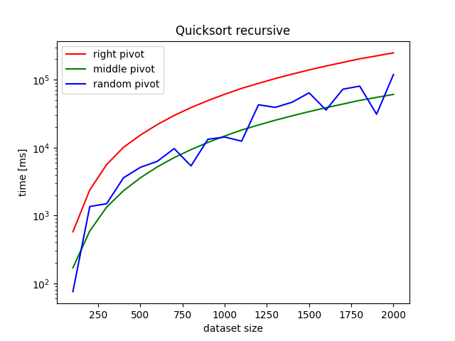

# algo1

Implementation and performance testing of several sorting methods for algorithmic classes.<br>
The most accurate measuring results can be obtained by using a UNIX-based system.<br>
The time it takes for the algorithm to perform the calculation is measured by the Perf counter.<br>
Each sorting algorithm's performance is shown on a generated graph, time vs. amount of data and data type.<br>
<br>
some performance statistics:
```bash
algo1_bigdata + algo1_QS_DATA runtime: 119m6s
algo1 + algo1_QS_DATA runtime: 1m36s
algo1 (all) runtime: 2m33s
```
example graphs:<br><br>

<br>


# create virtual environment, met requirements and run (UNIX)
```bash
git clone https://github.com/mateuszferenc/algo_pp
cd algo_pp/algo1
python3 -m venv venv
source venv/bin/activate
pip3 install -r requirements.txt

python3 algo1.py
```